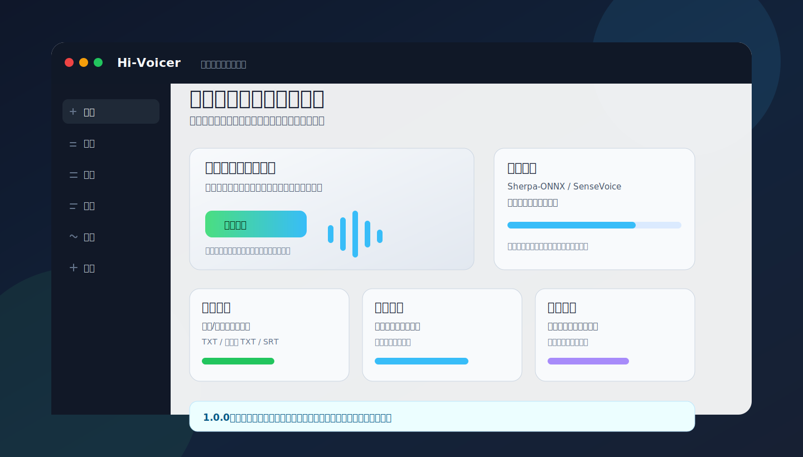

# Hi-Voicer

Hi-Voicer 是面向 Windows 的本地离线语音工作台。它把语音输入、音频/视频文件转写、字幕校对、术语替换和基础音频处理放在同一个桌面应用里完成；模型、录音、缓存和转写结果默认留在本机。



## 适合谁

- 想用快捷键在任意输入框里说话并自动上屏的用户。
- 需要把会议、网课、录音、视频整理成文字或字幕的用户。
- 希望转写流程尽量离线、本地可控的用户。
- 需要批量处理音频、校正字幕片段、维护术语替换表的用户。

## 主要能力

- 语音输入：支持按住说话、连续识别、纯录音三种模式。
- 文件转写：支持音频和常见视频文件，导出纯文本、时间线文本和 SRT 字幕。
- 字幕编辑：校正文案、拆分/合并字幕、播放选中片段、导出选中片段音频。
- 术语库：把常见错词、专有名词和客户名统一替换。
- 音频处理：降噪、增强、格式转换、视频提取音频、波形剪辑、多段导出和音频合并。
- 本机诊断：检查模型、运行时、麦克风、系统声音和 ffmpeg 状态。

## 1.2.1 更新重点

- 推理引擎统一为 `sherpa-onnx` Rust crate（原生进程内推理），彻底移除 `sherpa-onnx-offline.exe` 子进程依赖。
- 模型支持：SenseVoice Small、Qwen3-ASR 0.6B（ONNX INT8）、Paraformer 系列（含 FunASR Nano）。
- 推理后端：Sherpa-ONNX CPU only。
- 实时语音输入使用 Silero VAD 实时切句，每段语音结束后立即离线识别并输入文字。
- Qwen3-ASR GGUF 格式通过 llama.cpp 服务进程支持（可选），ONNX 格式通过 sherpa-onnx native 支持。
- 模型目录支持动态发现，可整体复制给其他用户后自动重绑定路径。
- 新增模型一键下载安装（Settings 界面），首次运行后按需下载即可，无需离线安装包预置模型。
- CUDA、cuDNN 和 GPU 运行文件继续排除在正式安装包之外。

详见：[Hi-Voicer 1.2.1 发布说明](docs/release-1.2.1.md)

## 当前模型策略

推理架构：`sherpa-onnx` Rust crate 原生 in-process 推理（CPU），不调用外部 .exe。

支持的模型格式：

| 模型 | 格式 | 引擎 | 说明 |
|---|---|---|---|
| SenseVoice Small | ONNX INT8 | sherpa-onnx native | 默认推荐，适合语音输入和短音频 |
| Qwen3-ASR 0.6B | GGUF Q8 | llama.cpp 服务进程 | 备选格式，需额外下载 llama.cpp 运行时 |
| Paraformer / FunASR Nano | ONNX | sherpa-onnx native | 支持，自动识别 paraformer/funasr 目录 |

## 开发与构建命令

首次准备开发环境：

```powershell
npm install
```

日常前端开发：

```powershell
npm run dev
```

运行 Tauri 桌面开发模式：

```powershell
npm run tauri -- dev
```

验证生产前端构建：

```powershell
npm run build
npm run preview
```

运行测试：

```powershell
npm test
```

## 发布安装包

发布命令会自动执行离线策略检查、准备 FFmpeg/Sherpa/模型资源、校验资源，然后构建安装包。

```powershell
# CPU 安装包
npm run release:cpu

# CUDA 安装包
npm run release:cuda

# CPU 和 CUDA 安装包
npm run release:all
```

发布文件输出到：

```text
dist-builds/
```

PowerShell 资源脚本不作为 npm 命令暴露，需要单独调试资源准备时，直接运行 `scripts/` 下对应的 `.ps1` 文件。

更多说明见：

- [模型说明](docs/模型说明.md)
- [环境准备](docs/环境准备.md)
- [0.2.1 打包测试清单](docs/0.2.1-打包测试清单.md)
